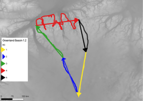

# ElmerIce meshing tools

This directory contains meshing tools designed to facilitate the mesh generation of real system 
and the interaction with GIS sofwares.

An example demonstrating the use of *Contour2geo.py* and *MeshToShp.py* can be found 
[here](https://cloud.univ-grenoble-alpes.fr/index.php/s/nFZEEKDDcTg8DD3)


## Contour2geo.py

**USAGE :**

```
python Contour2geo.py -r res [-h] [-i <inputfile>] [-o <outputfile>] [--spline] ')
```

Generate a [Gmsh](https://gmsh.info) geometry file (.geo) from a closed contour.  

The countour can be provided as :  

- an ASCII file with x,y cordinates.

- a shapefile: either a single polygon or a collection of polylines.

By default the contour is a Gmsh *compound line*, i.e. the mesh will exactly follow the contour nodes. 
In case of a very complex curved contour it might be interesting to *simplify* the contour, to avoid over-refinement.

*Splines* can be used with the argument **--spline**, but it may be less accurate to really track the countour and may leed to loops.

The mandatory *-r* argument prescribe the uniform mesh resolution. The mesh size is prescribed at the boundary nodes
and by prescribing a uniform background field. 

Once created the .geo can be edited to change the default values (see Gmsh documentation).

Mesh your file using:  
```
## basic gmsh
gmsh -2 [-format msh2] <outputfile>
## convert to Elmer mesh
ElmerGrid 14 2 [msh filename] -autoclean 
```

If the input file contains only one feature (ASCII file or shapefile with 1 polygon or 1 polyline), there will be only
one boundary condition type. Otherwise (in case of several polylines) each feature will be attributed
a *physical* identification.

If there is several polylines they must form an ordered closed countour. 
If the attribute *BC* (integer) is present, the program will use this attribute *BC* to order the lines as shown in the picture:  


In general, the workflow in a GIS sofware will be as follow:

- Create a polygon feature of you domain  
- Convert the *polygon* to *lines*  
- Split the lines where you want to define different boundary conditions
- Check that all the lines have the same orientation (you can reverse the orientation of the lines)
- Enventualy create the attribute BC (integer) and give the value so that the *BC* form a continuous closed contour  


## MeshToShp.py 

**USAGE :** 

```
python MeshToShp.py  [-h] -d <inputdir>
```

Generate shapefiles for the boundaries (polyline) and elements (polygons)
from a serial 2D Elmer mesh stored under *<inputdir>*

Shapefiles are stored under a new directory *<inputdir>_shp*.  

Attributes are:

- *BodyId* or *BCId*: the *body* or *BC* identification
- *etype* : the element type
- *enum* : the element number


## External resssources:

- [QGIS gmsh plugin](https://plugins.qgis.org/plugins/gmsh)
